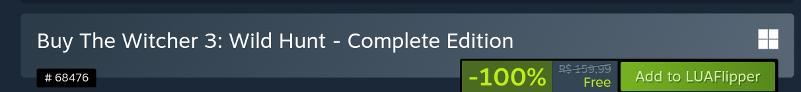
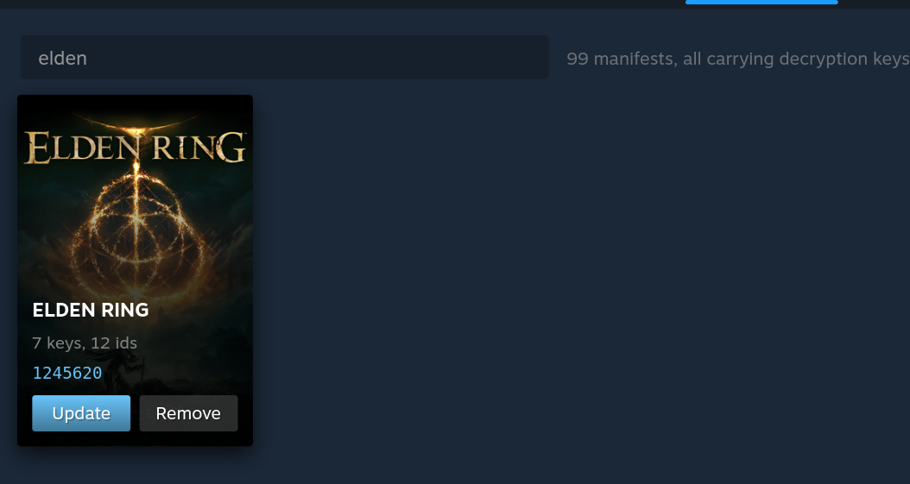
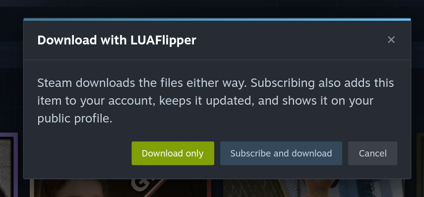

# Installing SteamFlipper

Two parts. The first happens in a terminal and is one command. The second
happens inside Steam and is one click.

> Needs Linux and the Steam client. Nothing is written outside `$HOME`, nothing
> needs root, and `./tools/install_linux.sh --uninstall` puts Steam back to
> stock. Budget about ten minutes, nearly all of it compiling.

---

## Part one: install

### 1. Install the build tools

The Steam client is a 32-bit binary, so a multilib toolchain is not optional.
The installer checks by actually compiling and linking, and names the missing
package rather than failing later with `file in wrong format`.

```bash
# Arch · Manjaro · CachyOS
sudo pacman -S --needed base-devel cmake ninja git \
        gcc-multilib lib32-glibc lib32-openssl

# Debian · Ubuntu · SteamOS
sudo dpkg --add-architecture i386 && sudo apt update
sudo apt install build-essential cmake ninja-build gcc-multilib \
        g++-multilib libc6-dev-i386 libssl-dev:i386

# Fedora · Nobara
sudo dnf install @development-tools cmake ninja-build \
        glibc-devel.i686 libstdc++-devel.i686 \
        openssl-devel.i686
```

**On an atomic image** (Bazzite, Silverblue, Kinoite, SteamOS), `dnf` is a shim that refuses and points at your image's documentation. Build in a container instead. It shares your home directory, so everything still lands on the host:

```bash
distrobox create --name steamflipper --image fedora:41
distrobox enter steamflipper
sudo dnf install -y @development-tools cmake ninja-build git \
                    glibc-devel.i686 libstdc++-devel.i686 openssl-devel.i686
```

Then clone and run the installer from inside that container. Close Steam **on the host** first. The installer's "Steam is running" check cannot see host processes from inside a container, and installing over a running client is the usual way this goes wrong.

> Steam must be installed natively. A Flatpak Steam is not supported: the module gets in by replacing a library next to the Steam binary, and in a Flatpak that library belongs to the read-only runtime. The installer detects this and says so.

### 2. Close Steam

A step of its own because skipping it is the usual way this goes wrong. The
installer replaces a library the running client holds open, and with Steam up
it refuses rather than half-installing.

```bash
steam -shutdown
```

### 3. Clone and run the installer

```bash
git clone https://github.com/IPedrax/SteamFlipper.git
cd SteamFlipper
./tools/install_linux.sh
```

One command does the whole job: it builds the 32-bit module, installs the
loader that gets it into Steam, generates the hook patterns for whichever Steam
build is on your disk, and registers the depot keys.

### 4. Start Steam and check the top bar

Launch Steam however you normally do. There is one more tab, after your account
name: **LUAFLIPPER**. It borrows the client's own markup, so a custom Steam skin
restyles it too.


No tab means the module did not load. Check
`grep -i steamflipper ~/.local/share/Steam/logs/bootstrap_log.txt` before
anything else, and check that step 2 actually happened, since installing over
a running Steam is the common cause.

---

## Part two: add a manifest

### 5. Open LUAFLIPPER, then Unlocker

Hover the tab for its menu and pick **Unlocker**. What opens is not a copy of
the store. It is Steam's real store, opened as this tab. Search and browse
exactly as you always would.

### 6. Find a game and look at the buy box

The purchase box has changed: the price is struck through and shown as a 100%
discount, and the green button now reads **Add to LUAFlipper**.



The original price stays struck through on purpose: this is the paid product,
obtained another way, and hiding it would make the row look like a free game.

This applies only on this tab. Leave it, or open the ordinary Store tab, and
the store is exactly as Valve shipped it. The integration is a lease the tab
has to keep renewing, so anything that ends the tab puts the real store back
within seconds.

### 7. Click Add to LUAFlipper

The button reports as it goes: `Adding 3s`, then `In library` once the manifest
is written, or `No source` if none of the configured sources carry that app.
Nothing reaches your real cart: the click never gets to Steam's own handler.

### 8. Restart Steam, then check Manage

Steam reads manifests once, at startup, so the game appears in your library on
the next launch and not before. To confirm what you have, open **LUAFLIPPER →
Manage** and hover any tile: each shows how many decryption keys and app ids its
manifest carries, and can be updated or removed. A removal stays undoable until
the next Steam start.



---

## Workshop items, the same way

**LUAFLIPPER → Workshop** gives you Steam's real workshop, exactly as the
Unlocker tab gives you the real store. **Subscribe** on an item's page, and the
green **+** on any listing row, are rebound to ask first:



**Download only** fetches the files and writes nothing to your account.
**Subscribe and download** also adds the item to your profile and lets Steam
keep it updated. The files land in
`steamapps/workshop/content/<appid>/<id>/`, in whichever library the game
lives in.

The download is done by the signed-in client itself, so it works for items
served from a UGC depot, the ones a direct link cannot reach, with no
SteamCMD and no third-party mirror.

---

## Adding one by hand

Nothing here depends on the Unlocker. A manifest is a plain Lua file in
`~/.local/share/Steam/config/stplug-in/`, named after the app id
(`1245620.lua` for Elden Ring), holding one `addappid` line per depot with its
decryption key:

```lua
-- 381210.lua  |  Dead by Daylight
addappid(381210, 1, "f17be424bd1dc965706d5527f803a0c4ae2c7aae87449be6f5bab17b7ac3a20c")
addappid(381211, 1, "66477a849ed619510d127ff3f05d4d37b38a04fd7074654337053dfe817798ca")
```

Drop one in and restart Steam; Manage will list it with the rest.

---

## If something is wrong

**The installer stopped on a missing package.** It names the one it needs.
Install that and run it again. It is safe to re-run as many times as you like.

**The tab is there but pages never finish loading.** A stale listener on port
1987, fixed in 1.0.5. Close Steam fully and start it again;
`ss -ltnp | grep 1987` should then show exactly one process.

**A game was added but is not in the library.** Steam only reads manifests at
startup, so restart it. If it is still missing, open **Manage**. If the tile is
not there either the add did not land, and **Sources** will say which hosts were
tried.

**Steam updated and nothing unlocks.** It should fix itself: hook addresses are
keyed to the hash of `steamclient.so`, and the module re-derives them on the
first launch after a client update. See *After a Steam update* in the README.

---

## Where to go next

| Page | What it is for |
|---|---|
| **Unlocker** | Steam's real store, with Add to Cart rerouted |
| **Workshop** | Steam's real workshop, with Subscribe rerouted to download |
| **Manage** | Every manifest you have, as a library grid |
| **Fixes** | Published fixes for a game, and extracting one into its folder |
| **Config** | Updates and the changelog, cloud saves, sources, status |

The porting notes that used to live in this file (why the module is
dual-architecture, how the `libXtst` bootstrap works, what the installer does
and why) are in the README and in the repository history.
